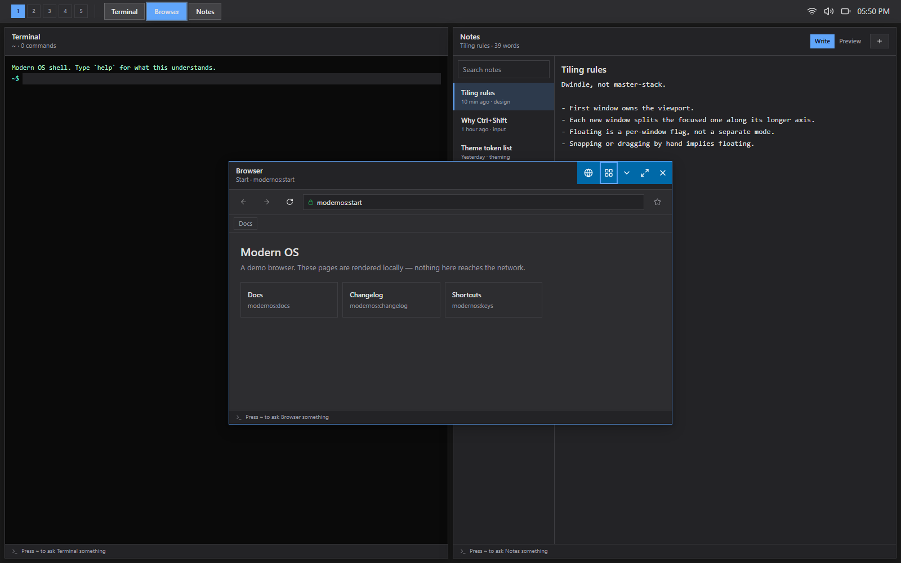
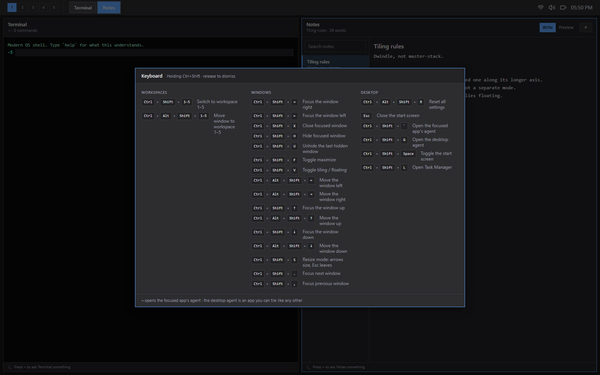
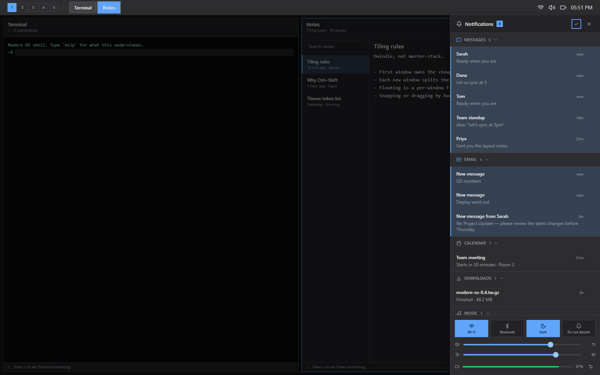
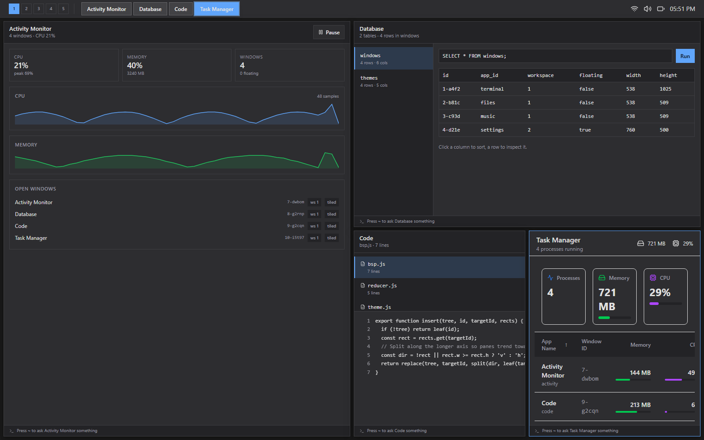

# Modern OS

A tiling desktop environment that runs in a browser tab. Windows arrange themselves into a BSP layout, five workspaces sit behind `Ctrl+Shift+1..5`, and the start screen is a wall of live tiles that update while you look at them — all of it on a headless kernel with a pure reducer, a keymap service, and a per-app permission manifest.

**[Live demo](https://monstercameron.github.io/Modern_os/app/)** · **[Project page](https://monstercameron.github.io/Modern_os/)**


## What this is

The apps are tenants; the system is the project. Most of the code is not in the 36 apps on the start screen — it is in the layer underneath them: a kernel that owns every window as pure state, a tiling engine that is a pure function from a workspace's window list to rectangles, a keymap with scopes and a reserved-chord audit, and a theme engine whose motion settings every animation has to ask for permission from.

It is a study in building the *shell* of an operating system with web primitives, not a mockup of one.

## Tiling by default, floating when you say so

Windows open into a dwindle layout: the first window owns the viewport, each new one splits the focused window along its longer axis. There are no title bars in tile mode — the layout owns the geometry, so a drag handle would be a lie, and the space goes to the app. `Ctrl+Shift+V` pops a window out into a floating one, and it grows a title bar on the way.


Snapping and dragging by hand imply floating, because you cannot drag something the layout is positioning for you. The two-axis state machine that decides all of this — placement × display — lives in `src/kernel/windowState.js` and refuses transitions rather than inventing them.



## The keyboard is the interface

`$mod` is `Ctrl+Shift`, because Windows swallows `Super`+digit before a browser tab ever sees it. Bindings are data in one registry with a scope stack, and a dev-time audit warns when a chord resolves to something the browser or the OS takes first.

Hold `Ctrl+Shift` for a moment and the current bindings appear, read from the live keymap rather than a written-down copy, so the sheet cannot drift from what the desktop does.



| Chord | Does |
|---|---|
| `$mod+1..5` | Switch workspace |
| `$mod+Alt+1..5` | Move the window to a workspace |
| `$mod+←↑→↓` | Focus the window that way |
| `$mod+Alt+←↑→↓` | Move it — tiled swaps with its neighbour, floating snaps |
| `$mod+S` | Resize mode: bare arrows size, `Esc` leaves |
| `$mod+V` · `$mod+F` | Toggle tiling/floating · toggle maximize |
| `$mod+H` · `$mod+U` | Hide the focused window · unhide the last one |
| `$mod+Space` · `$mod+G` | Start screen · desktop agent |
| `` $mod+` `` | The focused app's own agent |

Tab belongs to the focused window: it wraps inside it rather than walking out through the window behind and on into the taskbar. Moving between windows is what the chords above are for.

## Tiles are alive

Every tile carries its own state and animates when it changes. Nineteen simulated feeds drive them through one scheduler that lets at most two updates through per tick — a start screen where thirty tiles flip on the same frame is a slot machine, not a desktop.

The changes speak a small vocabulary: **flip** when an update replaces what was there, **slide** when it is the next item in a sequence, **roll** for a number that should count rather than cut, **peek** for something that should register without asking to be looked at, and an **attention ring** for the few that genuinely want you. The tile frame carries what is app-independent — a status light, a progress line, the ring — so a tile reports state whether or not anyone wrote it a face.

Feeds that represent messages push their counts into the kernel's badges and post to the notification bus, so a tile, its taskbar badge and the notification centre cannot disagree about how many unread emails there are.

## A notification panel, not a takeover

Notifications group by app, so twelve of them read as three sources rather than a wall. Each one dismisses on its own, unread is an accent edge that survives a dense list, and the times are real and tick while the panel is open. It is a column beside your work rather than a sheet over it.



## A tile is a format, not a decoration

The tile configurator treats a tile as a layout problem with a budget. Pick a span and it reports the exact geometry; the span buys a number of widget slots, and each widget spends them. A 1×1 tile has no slots and says so.


## Under the shell

| Layer | Where | What it does |
|---|---|---|
| Kernel | `src/kernel/` | Observable store, pure reducer, typed actions, memoised selectors — the single source of truth |
| Window machine | `src/kernel/windowState.js` | Placement (tiled/floating) × display (normal/minimized/fullscreen), as a total transition table |
| Tiling engine | `src/kernel/layout/bsp.js` | A binary tree per workspace; `tree => Map<windowId, rect>`, pure |
| Keymap | `src/services/keymap.js` | Chord parsing, scope stack, reserved-chord audit, hold detection |
| Theme + motion | `src/services/theme.js` | Colour, shape, depth and motion tokens; `reduced` drops decorative movement, `none` stops it |
| Tile feeds | `src/features/tiles/` | Simulated sources, the animation vocabulary, one scheduler |
| Event bus | `src/utils/eventBus.js` | Namespaced pub/sub between apps and the shell |
| App manifests | `src/config/manifests.js` | Per-app permissions, features and instance limits |
| Focus | `src/utils/focus.js` | One definition of what Tab can reach, shared by the WM and every overlay |

The rule the layering enforces: **UI dispatches actions and reads selectors; it never mutates window state directly.** That is what let the tiling engine drop in as a pure function without a single component learning it existed.

## Agents

Every app has a console on `~` that answers from that app's live state, and the desktop has one of its own on `$mod+G` — an app like any other, so the tiling engine places it beside the work it is talking about instead of over it.



## Getting started

```bash
npm install && npm run dev
```

The dev server runs on port 5173. There is no backend.

| Script | Does |
|---|---|
| `npm run dev` | Vite dev server with HMR |
| `npm run build` | Production bundle into `dist/` |
| `npm run lint` | ESLint over the project |
| `npm run build:pages` | Rebuild the demo published at `docs/app/` |
| `npm run serve:pages` | Serve `docs/` locally on port 5174 |

## Project layout

```
src/
  kernel/       store, reducer, actions, selectors, windowState, layout/bsp
  services/     keymap, theme, persistence
  features/     launcher, tiles (feeds + motion kit), shortcuts, agent, apps, workspaces
  components/   Tile, Win, Taskbar, NotificationCenter, ContextMenu
  config/       apps.js (the tile grid), manifests.js (permissions)
  hooks/        useDesktopKeymap, useMotion, useGridNavigation, useWindowManager
  utils/        eventBus, geometry, focus, spatialNav
docs/           this project's GitHub Pages site and the published demo
```

Deeper notes live in [`docs/`](docs/). The feature roadmap is in [`wants.md`](wants.md).

## Status

**Working** — BSP tiling with floating opt-out, five workspaces, the keymap and its cheatsheet, live tiles with nineteen feeds, the notification panel, per-app and desktop agents, the theme and motion engine, Task Manager over the real window list, and the tile configurator. All 36 apps render real content.

**Known gaps** — the taskbar and start screen do not yet read the theme tokens, so switching to a light theme changes app interiors and the notification panel but leaves the shell dark. Hide/unhide is asymmetric: `$mod+U` restores the last hidden window with no picker and nothing showing what is hidden. There is no control over split direction, so you cannot choose whether the next window lands beside or below.

## Built with

React 19 · Vite 7 · Tailwind CSS 4 · Framer Motion · lucide-react
