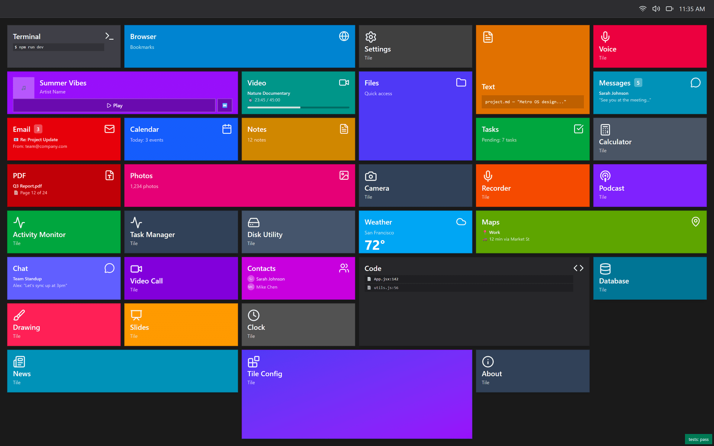
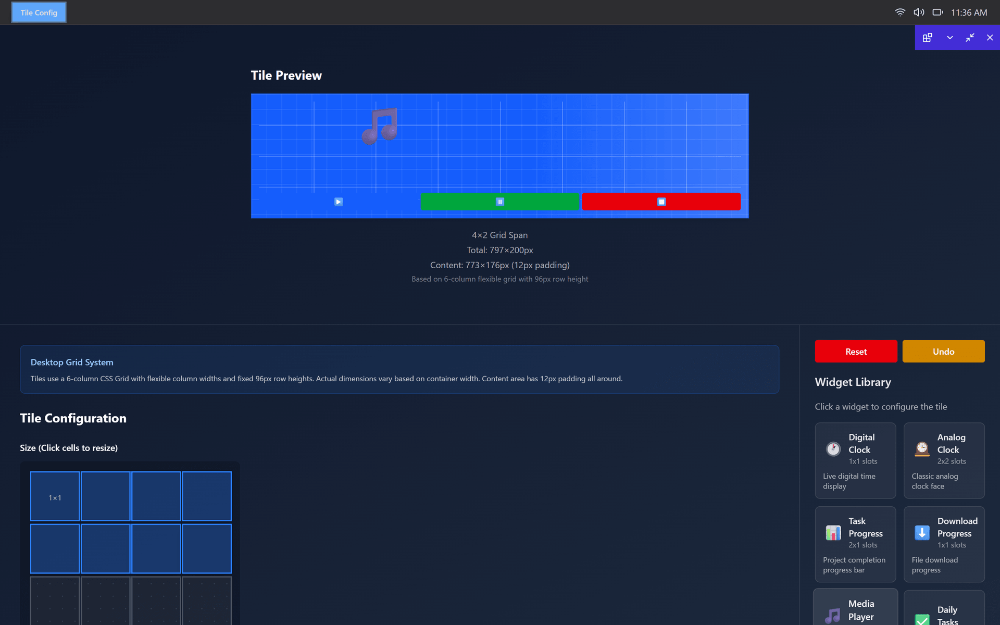
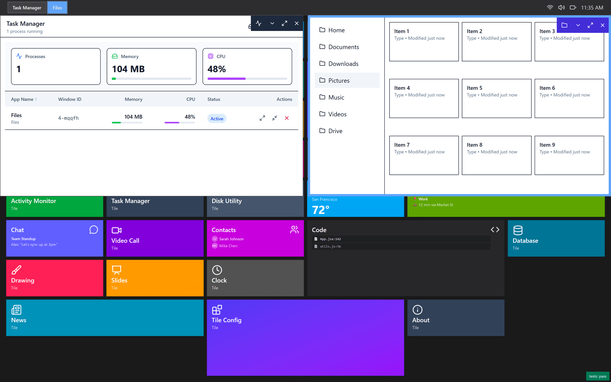
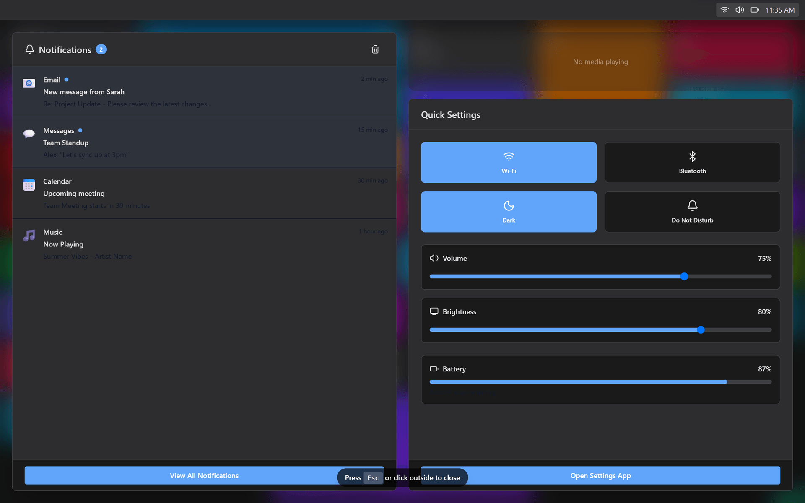

# Modern OS

A Metro-inspired desktop environment that runs in a browser tab. Live tiles launch apps, windows snap and stack, and a task manager lists them as processes — all of it on a shared event bus, three state machines, and a per-app permission manifest.

**[Live demo](https://monstercameron.github.io/Modern_os/app/)** · **[Project page](https://monstercameron.github.io/Modern_os/)**



## What this is

The apps are tenants; the system is the project. Most of the code is not in the 35 apps on the start screen — it is in the services underneath them: an event bus every app publishes and subscribes to, explicit state machines for window lifecycle, snapping and context menus, and a manifest that declares what each app is allowed to touch before it is allowed to run.

It is a study in building the *shell* of an operating system with web primitives, not a mockup of one.

## Tiles are the launcher

There are no icons. Every app is a colored tile that carries its own state — unread counts, now playing, the next calendar entry, a file path — and updates in place while you look at it. Right-click a tile to resize or pin it; long-press to put the whole grid into edit mode. The desktop is a six-column CSS grid with 96-pixel rows, and tiles claim spans of it.

## A tile is a format, not a decoration

The tile configurator treats a tile as a layout problem with a budget. Pick a span and it reports the exact geometry; the span buys a number of widget slots, and each widget spends them. A 1×1 tile has no slots and says so. Clocks, progress bars, a media player and a task list are all fitted against the same accounting.



| | |
|---|---|
| Grid | 6 flexible columns, 96px rows |
| 1×1 tile | 193 × 96px, 169 × 72px content |
| 4×2 tile | 797 × 200px, 8 widget slots |
| Padding | 12px on all four sides |

## Windows, with a process table behind them

Apps open into draggable windows that minimize, maximize and snap to halves and quadrants. The snap geometry is its own state machine, with smoke tests over the rectangles it produces. Task Manager reads the live window list, so every open app shows up with a window ID and can be focused, minimized or killed from the table.



## One action center

Notifications on the left with per-app icons and read state; media transport and quick settings on the right. The toggles and sliders publish to the same bus the apps listen on — switching to dark here is the same event the settings app fires.



## Under the shell

| Service | Where | What it does |
|---|---|---|
| Event bus | `src/utils/eventBus.js` | Namespaced pub/sub — window, media, notification, taskbar, tile and context-menu topics |
| State machines | `src/utils/*StateMachine.js` | Window lifecycle, snap-zone selection and menu state as explicit transitions |
| App manifests | `src/config/manifests.js` | Per-app permissions (network, storage, camera, mic), features and instance limits |
| Theme engine | `src/ThemeContext.jsx` | Accent, background, surface, text and border tokens; six presets, light/dark switch |
| Snap geometry | `src/utils/geometry.js` | Halves, quadrants and edge targets computed from the viewport |
| Error boundaries | `src/components/ErrorBoundary.jsx` | A crashing app takes down its own window, not the desktop |

A smoke-test suite runs at boot and reports pass/fail in the corner of the desktop.

## Getting started

```bash
git clone https://github.com/monstercameron/Modern_os.git
cd Modern_os
npm install
npm run dev
```

The dev server runs on port 5173. There is no backend.

| Script | Does |
|---|---|
| `npm run dev` | Vite dev server with HMR |
| `npm run build` | Production bundle into `dist/` |
| `npm run lint` | ESLint over the project |
| `npm run build:pages` | Rebuild the demo published at `docs/app/` |
| `npm run serve:pages` | Serve `docs/` locally on port 5174 |

## Project layout

```
src/
  apps/         one file per app; most are placeholders on a shared shell
  components/   Tile, Win, Taskbar, NotificationCenter, ContextMenu, SnapOverlay
  config/       apps.js (the tile grid), manifests.js (permissions), layout.js
  hooks/        useClock, useContextMenu, useDragManager
  utils/        eventBus, state machines, snap geometry, error handling
  tests/        smoke tests run at boot
docs/           this project's GitHub Pages site and the published demo
```

Deeper notes live in [`docs/`](docs/) — the event bus, both state machines, the tile spec, theming, context menus and error handling each have their own document. The feature roadmap is in [`wants.md`](wants.md).

## Status

**Working** — tile grid with live content and resize, window manager (drag, snap, minimize, maximize), taskbar, action center, quick settings, theme engine with six presets, Task Manager over the real window list, and the tile configurator.

**In progress** — 13 of 35 apps render real content; the rest open a placeholder. Settings has Personalization wired and the other panes stubbed. Theme tokens do not yet reach every app interior, and several bus topics publish to no subscriber.

**Next** — take one app end to end across every service as the template for the rest, wire the tile context-menu actions to handlers, then virtual desktops and window grouping.

## Built with

React 19 · Vite 7 · Tailwind CSS 4 · Framer Motion · lucide-react
